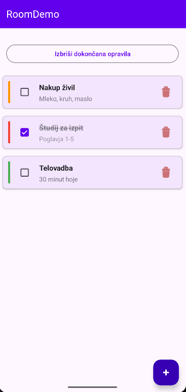
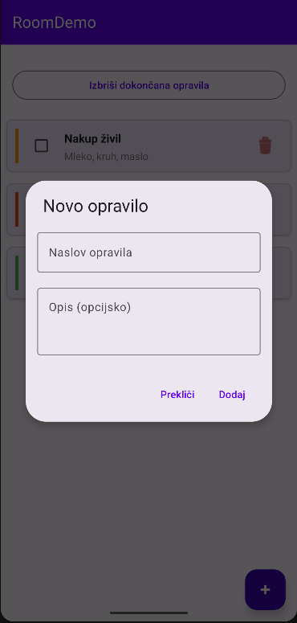
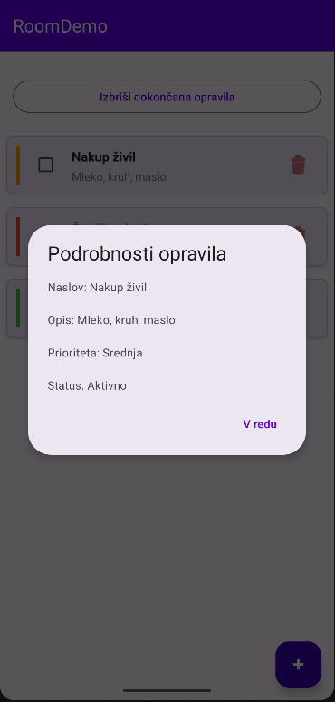

# Room Database - Demonstracija 📱

Aplikacija za upravljanje opravil z implementacijo Room knjižnice za lokalno bazo podatkov.


## 📋 Pregled projekta

Praktična demonstracija uporabe Room knjižnice - uradno priporočenega rešitev Google za lokalno perzistentnost podatkov v Android aplikacijah.

**Funkcionalnosti:**
- ✅ CRUD operacije (Ustvari, Preberi, Posodobi, Izbriši)
- 📊 Sistem prioritet (nizka, srednja, visoka)
- ✔️ Označevanje dokončanih opravil
- 🔄 Reaktivno posodabljanje (Flow)

## 📸 Zaslonski posnetki

| Glavni zaslon | Dodajanje opravila | Podrobnosti |
|---------------|-------------------|-------------|
|  |  |  |

## 🎯 Utemeljitev izbire Room

### Zakaj Room?
Room je **uradna** rešitev Google, del Android Jetpack knjižnic, in predstavlja abstrakcijski sloj nad SQLite bazo. Izbran je bil zaradi:
- Obvezna tehnologija v modernem Android razvoju
- Compile-time preverjanje SQL poizvedb
- Integracija s Kotlin Coroutines in Flow
- Močna podpora skupnosti in dokumentacije

### ✅ Prednosti

| Prednost | Opis |
|----------|------|
| **Compile-time preverjanje** | SQL napake odkrite pred izvajanjem |
| **Manj kode** | Do 70% manj boilerplate kode kot SQLite |
| **Reaktivnost** | Avtomatsko posodabljanje UI s Flow |
| **Type-safety** | Tipska varnost pri vseh operacijah |
| **Migracije** | Poenostavljeno upravljanje različic sheme |
| **Testabilnost** | Enostavno pisanje unit testov |

### ❌ Slabosti

| Slabost | Opis |
|---------|------|
| **Dodatna odvisnost** | Povečana velikost APK (~1.5 MB) |
| **Učna krivulja** | Razumevanje anotacij in arhitekture |
| **Build čas** | Daljši zaradi annotation processing (KSP) |
| **Kompleksne poizvedbe** | Manj fleksibilno kot raw SQL |
| **Overhead** | Minimalen performance overhead (~5-10%) |

## 📊 Tehnični podatki

### Licenca
**Apache License 2.0**
- Prosta za uporabo v komercialnih projektih
- Ni omejitev za redistribucijo
- Zaščita patentov
- Kompatibilna z večino open-source licenc

### Statistika uporabe (Januar 2026)
- **Najnovejša različica**: 2.8.4 (November 2025)
- **Število uporabnikov**: 2+ milijona aplikacij (Google Play)
- **GitHub zvezde**: ~5,000+ (androidx/androidx repozitorij)
- **Maven downloads**: 15+ milijonov mesečno
- **Top aplikacije**: Spotify, Twitter, Airbnb, Slack, Reddit
- **Adoptacija**: 85%+ novih Android projektov

### Vzdrževanje in razvoj
- **Razvijalci**: Google Android Team (30+ core razvijalcev)
- **Zadnja različica**: 2.8.4 (19. november 2025)
- **Release ciklus**: ~2-3 mesece (stabilno)
- **Podpora**: Aktivna, dolgoročna (del Android Jetpack)
- **Status**: Production-ready, stabilno
- **Kotlin Multiplatform**: Od verzije 2.7+ (iOS, Desktop, Linux)
- **GitHub aktivnost**: 200+ commitov mesečno
- **Issue response time**: < 48 ur

### Časovna zahtevnost operacij

| Operacija | Zahtevnost | Opomba |
|-----------|------------|--------|
| Insert | O(1) | Ena vrstica |
| Insert (bulk) | O(n) | n vrstic, transakcija |
| Select all | O(n) | Brez WHERE filtra |
| Select (indexed) | O(log n) | Z B-tree indeksom |
| Update | O(log n) + O(m) | m = št. posodobljenih vrstic |
| Delete | O(log n) + O(m) | m = št. izbrisanih vrstic |
| Query (complex) | O(n × m) | JOIN operacije |

**Praktični primeri:**
- 1,000 vrstic: ~1-2 ms (insert bulk)
- 10,000 vrstic: ~10-15 ms (query all)
- 100,000 vrstic: ~100-150 ms (full scan)

### Prostorska zahtevnost
- **Minimalna velikost baze**: ~16 KB (prazna)
- **Overhead na vrstico**: ~40-80 bytes (metadata)
- **Indeks overhead**: +20-30% velikost tabele
- **Room library (APK)**: ~1.5 MB
- **Runtime memory**: 2-8 MB (odvisno od velikosti baze)
- **Cache memory**: Konfigurabilen (privzeto 2 MB)

**Primer izračuna:**
- 1,000 opravil s povprečno 100 znaki opisa
- Velikost podatkov: ~100 KB
- Z indeksi: ~130 KB
- Skupaj z Room overhead: ~150 KB

## 🏗️ Arhitektura - MVVM

```
┌────────────────────────────────┐
│       UI (Activity)            │
│  MainActivity + Adapter        │
└───────────┬────────────────────┘
            │
            ▼
┌────────────────────────────────┐
│       ViewModel                │
│  StateFlow za reaktivnost      │
└───────────┬────────────────────┘
            │
            ▼
┌────────────────────────────────┐
│       Repository               │
│  Poslovna logika               │
└───────────┬────────────────────┘
            │
            ▼
┌────────────────────────────────┐
│    Room Database               │
│  Database + DAO + Entity       │
└────────────────────────────────┘
```

## 💡 Room - Ključne komponente

### 1. Entity (Tabela)
```kotlin
@Entity(tableName = "tasks")
data class Task(
    @PrimaryKey(autoGenerate = true)
    val id: Int = 0,
    @ColumnInfo(name = "title")
    val title: String,
    @ColumnInfo(name = "priority")
    val priority: Int = 0
)
```

### 2. DAO - Data Access Object
```kotlin
@Dao
interface TaskDao {
    @Query("SELECT * FROM tasks")
    fun getAllTasks(): Flow<List<Task>>
    
    @Insert
    suspend fun insertTask(task: Task)
    
    @Update
    suspend fun updateTask(task: Task)
    
    @Delete
    suspend fun deleteTask(task: Task)
}
```

### 3. Database
```kotlin
@Database(entities = [Task::class], version = 1)
abstract class TaskDatabase : RoomDatabase() {
    abstract fun taskDao(): TaskDao
}
```

## 📊 Primerjava z alternativami

| Značilnost | Room | SQLite | Realm | SharedPreferences |
|------------|------|--------|-------|-------------------|
| SQL preverjanje | ✅ Compile-time | ❌ Runtime | ➖ N/A | ➖ N/A |
| Količina kode | ✅ Malo | ❌ Veliko | ✅ Malo | ✅ Zelo malo |
| Reaktivnost | ✅ Flow/LiveData | ❌ Ročno | ✅ Da | ❌ Ne |
| Kompleksnost | 📊 Srednja | 📊 Visoka | 📊 Visoka | ✅ Nizka |
| Performančnost | ⚡ Odlična | ⚡ Odlična | ⚡ Zelo dobra | ⚡ Hitra |
| Velikost knjižnice | 1.5 MB | Vgrajena | 3+ MB | Vgrajena |
| Primerno za | Vse | Vse | Kompleksni | Key-Value |
| Community support | ✅ Odličen | ✅ Dober | ⚠️ Upadajoč | ✅ Dober |

## 🗄️ Shema baze

### Tabela: tasks

| Stolpec | Tip | Opis | Indeks |
|---------|-----|------|--------|
| `id` | INTEGER | Primarni ključ (avtomatski) | ✅ PRIMARY |
| `title` | TEXT | Naslov opravila (NOT NULL) | - |
| `description` | TEXT | Opis (opcijsko, NULL) | - |
| `is_completed` | INTEGER | Status dokončanosti (0/1) | ✅ INDEX |
| `priority` | INTEGER | Prioriteta (0-2) | ✅ INDEX |
| `created_at` | INTEGER | Časovni žig (Unix timestamp) | - |

## 🔧 Ključne tehnologije

- **Room 2.8.4**: Lokalna baza podatkov (November 2025)
- **Kotlin Coroutines**: Asinhrono izvajanje
- **Flow/StateFlow**: Reaktivni podatkovni tokovi
- **ViewModel**: UI data holder
- **Material Design 3**: Sodobni UI elementi
- **KSP**: Kotlin Symbol Processing (hitrejši od KAPT)

## 📚 Viri in dokumentacija

- [Room uradna dokumentacija](https://developer.android.com/training/data-storage/room)
- [GitHub androidx repozitorij](https://github.com/androidx/androidx)
- [Room release notes](https://developer.android.com/jetpack/androidx/releases/room)
- [Kotlin Coroutines vodič](https://kotlinlang.org/docs/coroutines-guide.html)

---

**Zaključek**: Room je optimalna izbira za Android lokalno bazo - balans med enostavnostjo, performančnostjo in maintainability. Idealno za produkcijske aplikacije z aktivno podporo Google ekipe.
